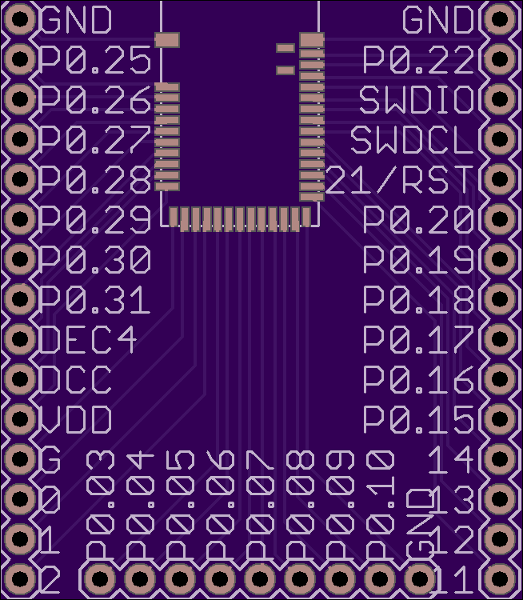
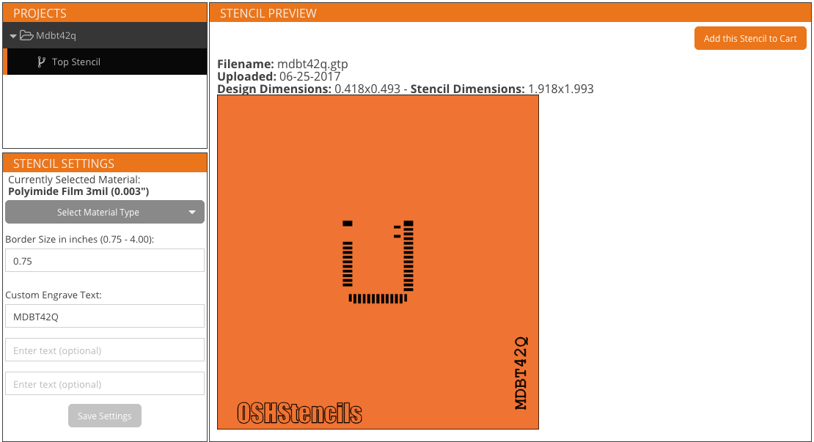
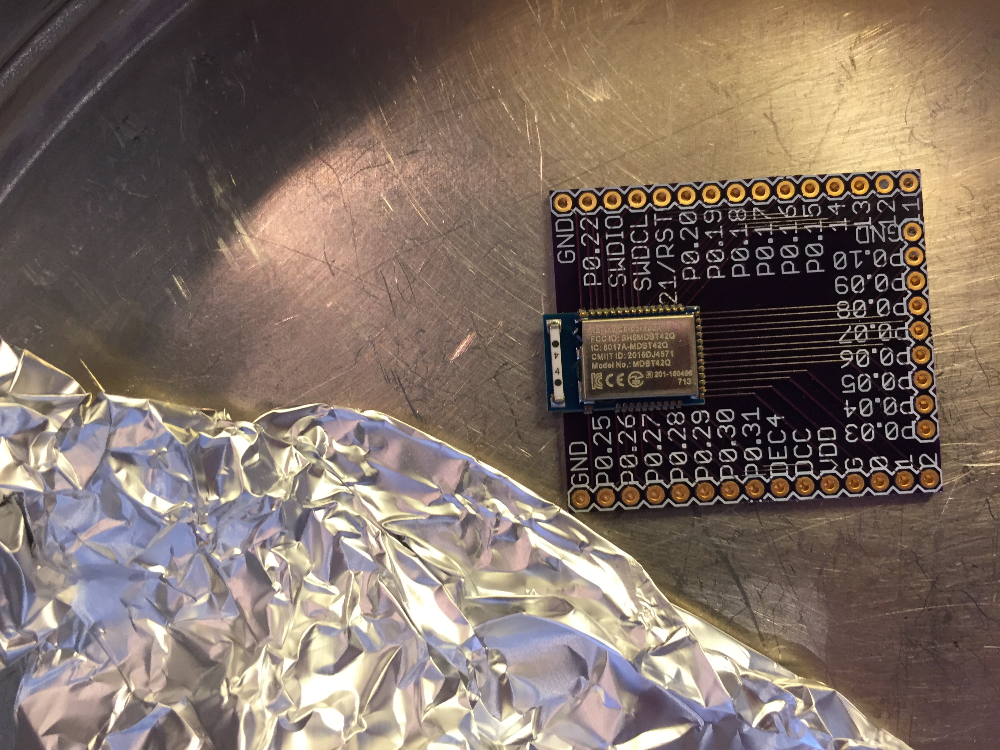

# MDBT42Q-breakout-eagle
Eagle files for making a breakout board for Raytac's MDBT42Q - nRF52832 based BLE module

Ordered MDBT42Q modules from [Tinysine](https://www.tinyosshop.com/mdbt42-ble-module), due to low shipping to Norway. $7.95 each, plus $4 shipping to Norway. Alternative: [Seed](https://www.seeedstudio.com/MDBT42Q-nRF52832-based-BLE-module-p-2736.html) 

Uploaded MDBT42Q.brd and ordered board from [OSH Park](https://oshpark.com/shared_projects/iggYdmAZ). Link contains shared project, ready for order. $9.80 per batch of three.

Uploaded MDBT42Q.brd and ordered solder stencil and acrylic jig set from [OSH Stencils](https://www.oshstencils.com/) for 10 $ + 5 $ shipping to Norway. Stencil Polyimide Film 3mil (0.003").

Used lead-free solder paste from [SparkFun/Chip Quik](https://www.sparkfun.com/products/12878).

After applying solder paste using the stencil, jig set and solder paste spreader (included in the jig set), the MDBT42Q module was placed gently on top of the solder and board. It doesn't matter much that the solder is smeared a bit, as the reflow will draw the solder to the solder pads. 

The board was placed in an old springform cake tin, and placed on a kitchen stove plate to reflow the solder. Turning the plate on, I used a digital cooking thermometer placed under some tin foil to monitor the cake tin temperature. My thermometer read ca. 223 deg C when the solder paste had reflowed properly. See solder paste data sheet for recommended reflow temperature profile (max 249 deg C). When the solder had reflowed properly, the cake tin was removed from the hot plate to cool. The result:

Using a JTAG programmer, such as the one included on Nordic's [nRF52 Developer Kit](https://www.nordicsemi.com/eng/Products/Bluetooth-low-energy/nRF52-DK), I was able to program the MDBT42Q module. More on that later. See for example 

https://learn.sparkfun.com/tutorials/nrf52832-breakout-board-hookup-guide

https://devzone.nordicsemi.com/f/nordic-q-a/14058/external-programming-using-nrf52-dk

Connecting the nRF52 DK to the MDBT42Q:

