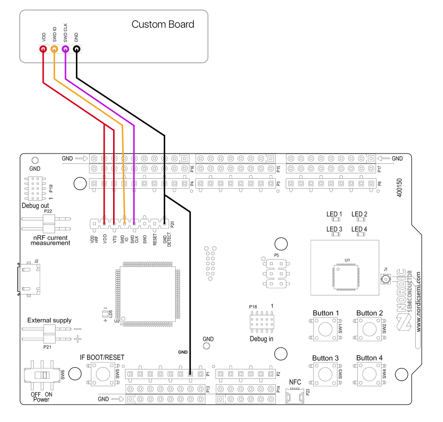

# MDBT42Q-breakout-eagle
Eagle files for making a breakout board for Raytac's MDBT42Q - nRF52832 based BLE module

Ordered MDBT42Q modules from [Tinysine](https://www.tinyosshop.com/mdbt42-ble-module), due to low shipping to Norway. $7.95 each, plus $4 shipping to Norway. Alternative: [Seed](https://www.seeedstudio.com/MDBT42Q-nRF52832-based-BLE-module-p-2736.html) 

Uploaded MDBT42Q.brd and ordered board from [OSH Park](https://oshpark.com/shared_projects/iggYdmAZ). Link contains shared project, ready for order. $9.80 per batch of three.

Uploaded MDBT42Q.brd and ordered stencil from [OSH Stencils](https://www.oshstencils.com/) for 10 $ + 5 $ shipping to Norway. Polyimide Film 3mil (0.003").

Used lead-free solder paste from [SparkFun/Chip Quik](https://www.sparkfun.com/products/12878).

Using a JTAG programmer, such as the one included on Nordic's [nRF52 Developer Kit](https://www.nordicsemi.com/eng/Products/Bluetooth-low-energy/nRF52-DK), I was able to program the MDBT42Q module. More on that later. See for example https://learn.sparkfun.com/tutorials/nrf52832-breakout-board-hookup-guide

Connecting the nRF52 DK to the MDBT42Q:

